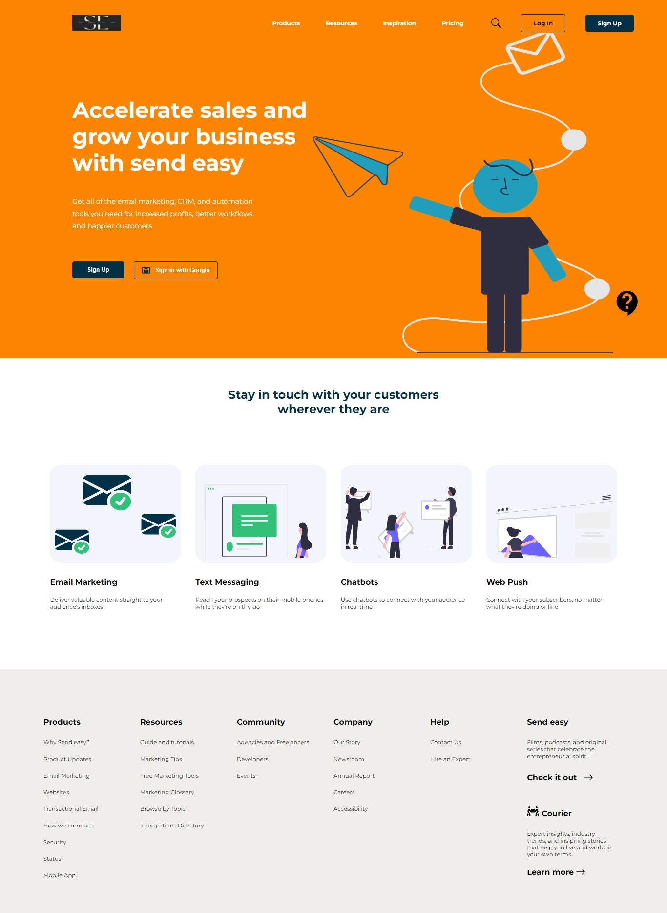
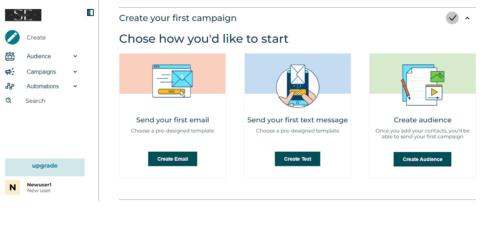

## Table of contents

- [SEND EASY](#SENDEASY)
  - [Screenshot](#screenshot)
  - [Screenshot2](#screenshot2)
  - [Links](#links)
- [My process](#my-process)
  - [Built with](#built-with)
  - [What I learned](#what-i-learned)
  - [Continued development](#continued-development)
  - [Useful resources](#useful-resources)
- [Author](#author)
- [Acknowledgments](#acknowledgments)

### SEND EASY

Users should be able to:

- View the optimal layout for the site depending on their device's screen size
- Route to different pages on the website.

### Screenshot

## Screenshot2

### Links

- Solution URL: [https://github.com/Dexie14/sendEasy.git](https://github.com/Dexie14/sendEasy.git)

## My process

........🥶😱😰😢😔😓😴🤔🤗😊😋😎

### Built with

- React @v18
- Semantic JSX markup
- CSS modules
- FlexboX/Grid
- react hooks

### What I learned

At first glance, The project seemed all difficult and not achievable knowing I have to implement with REACT for the first time. Of course, learnt a lot working with this project, the realization of a particular means to making my code effective and learning new things... Quite Amazing I must say. 

I learnt how to create the react app from different terminals and installation of different react packages from npm website and their usages, react hooks( there wasn't so much of state management and I would still say there was a lot of state management as I layed my hands on perfecting the ones I needed to in this project 🤗), use of css modules, use of semantic jsx, use of react-router-dom and more....

### Continued development

I am definitely working more on understanding react hooks such as useState, useEffect etc, understanding user context/context API, folder structuring, component and props, usages of different packages and css frameworks. 

### Useful resources

- [w3schools](https://www.w3schools.com/) - This helped me to see better ways of applying my codes. I really liked their system pattern.
- [stackoverflow](https://stackoverflow.com/) - This is an amazing site which helped me to find solutions to problems I faced in working out my code.
- [react-router-dom](https://reactrouter.com/docs/en/v6/getting-started/overview) - This helped me to understand how to use react router and how to use react router dom.
- [Youtube] (https://www.youtube.com/) - I am really say everyone needs youtube.

## Author

- Github - [@Dexie14](https://github.com/Dexie14)
- Twitter - [@adeluadeoniye14](https://www.twitter.com/adeluadeoniye14)
- LinkedIn - [@adelu-adeoniye](https://www.linkedin.com/in/adelu-adeoniye/)

## Acknowledgments

A very big thank you to everyone who assisted me in understanding the project better. I would also like to thank Grazac academy for providing the great opportunity to solve challenges and give a space for building up.
